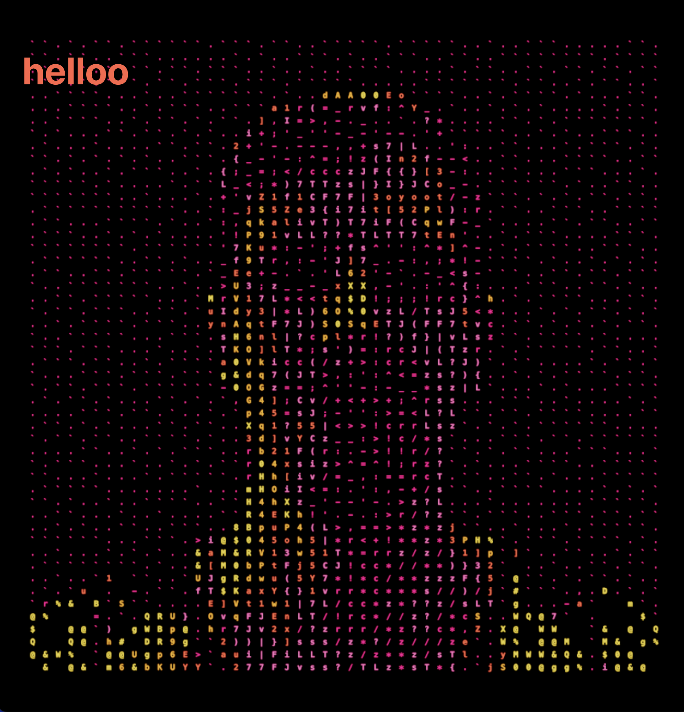

# Погрузитесь в мир ASCII искусства с three.js и WebGPU!




## О проекте

Этот проект демонстрирует использование библиотеки three.js с WebGPU для создания ASCII текстуры на основе изображения. Проект включает в себя следующие технологии и компоненты:

- **three.js**: библиотека для создания и отображения 3D-графики в браузере.
- **WebGPU**: современный графический API, обеспечивающий высокую производительность рендеринга.

## Основные компоненты

### Sketch

Класс `Sketch` отвечает за инициализацию сцены, камеры, рендера и объектов. Основные методы включают:

- `createScene()`: создание сцены.
- `createCamera()`: создание камеры.
- `createRenderer()`: создание рендера с использованием WebGPU.
- `addOrbitControls()`: добавление контроллера OrbitControls.
- `createASCIITexture()`: создание ASCII текстуры на основе символов.
- `addObjects()`: добавление объектов на сцену.

### getMaterial

Функция `getMaterial` создает материал для объектов, используя ASCII текстуру и палитру цветов. Основные компоненты включают:

- `asciiTexture`: текстура с ASCII символами.
- `uTexture`: текстура изображения.
- `asciiCode`: функция для вычисления цвета пикселя на основе яркости и ASCII символа.


## Запуск проекта

Для запуска проекта выполните следующие шаги:

1. Установите зависимости:
   ```bash
   npm install
   ```

2. Запустите проект:
   ```bash
   npm run dev
   ```

Проект будет доступен по адресу `http://localhost:3000`.
